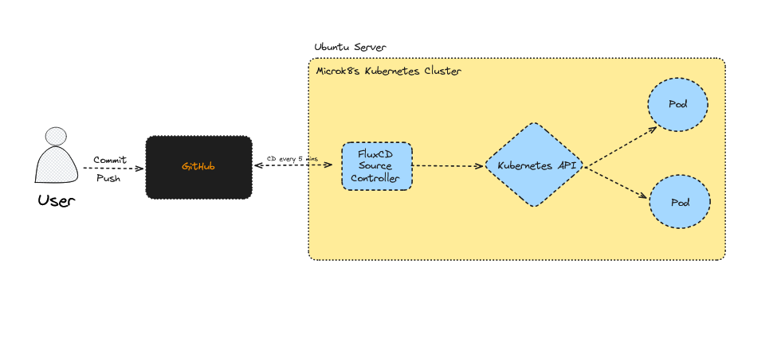

# FluxCD + MicroK8s — Step-by-Step Guide

WorkFlow




---
## Project file structure (recommended)

```
flux-microk8s-sample/
└── clusters/
    ├── microk8s/
    │   └── flux-system/      # created by flux bootstrap
    └── dev/
        ├── kustomization.yaml  # kustomize (plain)
        └── nginx.yaml
```

---

# 1. Install MicroK8s

```bash
sudo snap install microk8s --classic
sudo microk8s status --wait-ready
sudo microk8s enable dns storage
# (optional) allow your user to use microk8s without sudo:
# sudo usermod -a -G microk8s $USER && newgrp microk8s
```

---

# 2. Install Flux CLI

```bash
curl -s https://fluxcd.io/install.sh | sudo bash
flux --version
```

---

# 3. Create GitHub repository

Create an empty repo (e.g. `flux-microk8s-sample`) on GitHub and clone it locally:

```bash
git clone https://github.com/<your-user>/flux-microk8s-sample.git
cd flux-microk8s-sample
```

---

# 4. Create GitHub Personal Access Token (PAT)

1. Go to: `https://github.com/settings/tokens`
2. Create a token with at least:

   * `repo` (Read & Write)
   * `workflow` (optional, recommended)
3. Copy the token.

On your Ubuntu server export the values:

```bash
export GITHUB_USER="<your-github-username>"
export GITHUB_TOKEN="<your-personal-access-token>"
```

(Alternatively store credentials via `git credential.helper` — see step 4b.)

---

## 4b. Optional — Store git credentials (so flux/bootstrap can push)

```bash
git config --global credential.helper store
git ls-remote https://github.com/$GITHUB_USER/flux-microk8s-sample.git
# Enter username: <your-github-username>
# Enter password: <your-personal-access-token>
# Credentials are saved in ~/.git-credentials
```

---

# 5. Bootstrap Flux into MicroK8s

MicroK8s keeps its kubeconfig inside the snap. Either export KUBECONFIG or pass the path to flux.

Set kubeconfig (temporary or add to .bashrc):

```bash
export KUBECONFIG=/var/snap/microk8s/current/credentials/client.config
```

Bootstrap Flux (example):

```bash
flux bootstrap github \
  --owner=$GITHUB_USER \
  --repository=flux-microk8s-sample \
  --branch=main \
  --path=clusters/microk8s \
  --personal \
  --kubeconfig=/var/snap/microk8s/current/credentials/client.config
```

This will:

* Install Flux controllers into the cluster (`flux-system` ns)
* Commit initial Flux manifests to `clusters/microk8s` in your repo

If bootstrap fails with a GitHub 404:

* confirm `$GITHUB_TOKEN` is set and has required scopes
* or create the repo manually and re-run bootstrap

---

# 6. Verify Flux controllers

```bash
microk8s kubectl get pods -n flux-system
# expected: source-controller, kustomize-controller, helm-controller, notification-controller
```

Check Flux CLI can reach the cluster:

```bash
export KUBECONFIG=/var/snap/microk8s/current/credentials/client.config
flux get kustomizations -A
flux get sources git -A
```

---

# 7. Add a simple Nginx app

Create `flux-microk8s-sample/clusters/microk8s/dev/kustomization.yaml`:

```yaml
apiVersion: kustomize.config.k8s.io/v1beta1
kind: Kustomization
namespace: dev
resources:
- nginx.yaml
```

Create 'flux-microk8s-sample/clusters/microk8s/dev/nginx.yaml'

```yaml
apiVersion: v1
kind: Service
metadata:
  name: nginx
  namespace: dev
  labels:
    app: nginx
spec:
  selector:
    app: nginx
  ports:
  - port: 80
    name: nginx
---
apiVersion: apps/v1
kind: Deployment
metadata:
  name: nginx
  namespace: dev
  labels:
    app: nginx
spec:
  replicas: 3
  selector:
    matchLabels:
      app: nginx
  template:
    metadata:
      labels:
        app: nginx
    spec:
      containers:
      - name: nginx
        image: nginx:latest
        ports:
        - containerPort: 80
        resources:
          requests:
            memory: '100Mi'
            cpu: '25m'
          limits:
            memory: '100Mi'
            cpu: '25m'
```

Commit and push:

```bash
git add clusters/microk8s/dev/nginx.yaml clusters/microk8s/dev/kustomization.yaml
git commit -m "Add nginx app manifests"
git push
```

---
Flux will detect the new Kustomization and start reconciling.

---

# 8. Ensure the target namespace exists

If Flux logs show `namespaces "dev" not found`, create it:

```bash
microk8s kubectl create namespace dev
```

Flux will then be able to apply resources into `dev`.

---

# 9. Check Flux status and resources

```bash
flux get kustomizations -A
flux get sources git -A
microk8s kubectl get pod -n dev #it will shows nginx pod that you deploy as replicas amount
microk8s kubectl get events -n flux-system --sort-by=.metadata.creationTimestamp
```

If `flux get kustomizations` shows `READY True` → it worked.

---

# Troubleshooting quick checklist

* **Flux CLI connection**: ensure `KUBECONFIG=/var/snap/microk8s/current/credentials/client.config`
* **GitHub auth**: `$GITHUB_TOKEN` valid and with `repo` scope, or credentials stored in `~/.git-credentials`
* **Flux watches path**: Flux only applies files under the `path:` value in the Flux Kustomization
* **Namespace exists**: If `targetNamespace` is set, make sure namespace is created before apply (Flux can create namespaces if you include namespace manifests)
* **File types**: Flux resource `Kustomization` is not the same as Kustomize `kustomization.yaml`. Use Flux's `Kustomization` CR to point to folders.

---

# Example useful commands

```bash
# confirm controllers
microk8s kubectl get pods -n flux-system

# follow logs of a controller
microk8s kubectl logs -n flux-system deployment/kustomize-controller -f

# list Flux resources
flux get sources git -A
flux get kustomizations -A

# check cluster resources
microk8s kubectl get all -A
```

---
***Reference: DopEvs k8s Course***

***Created by Htoo Eain Lin (for practice and continous learning)***


